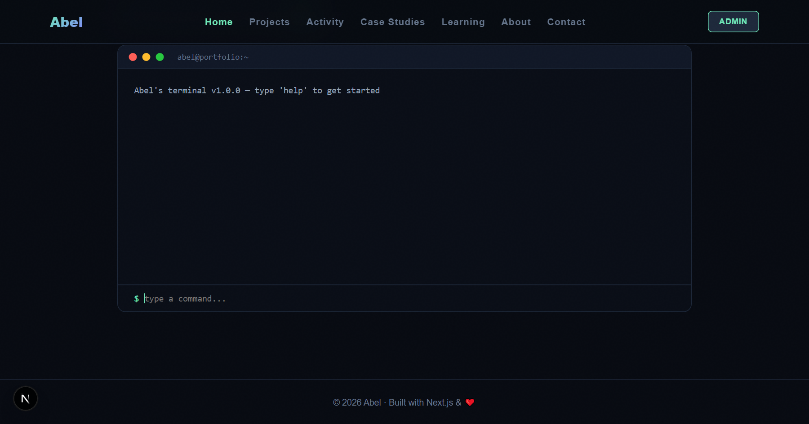
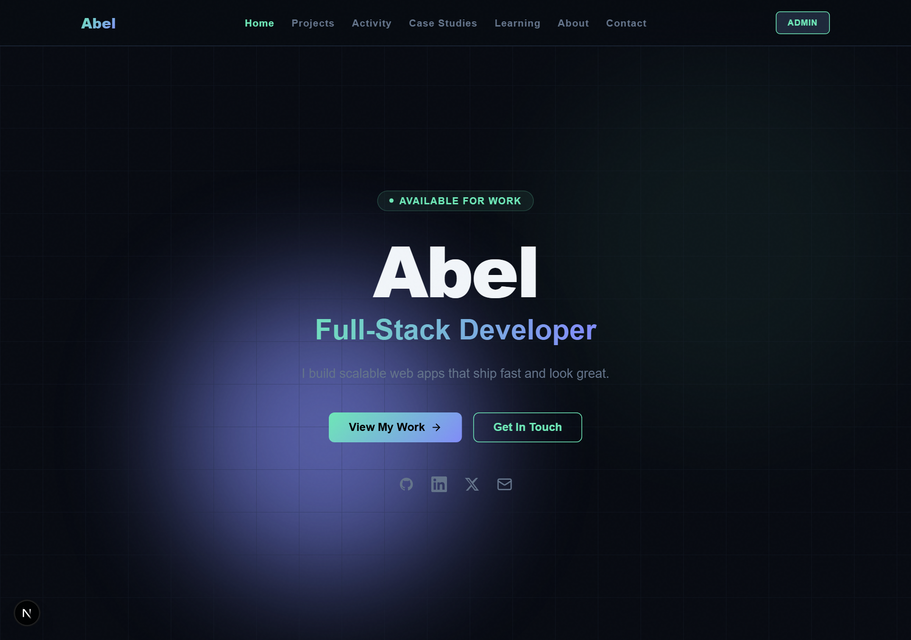
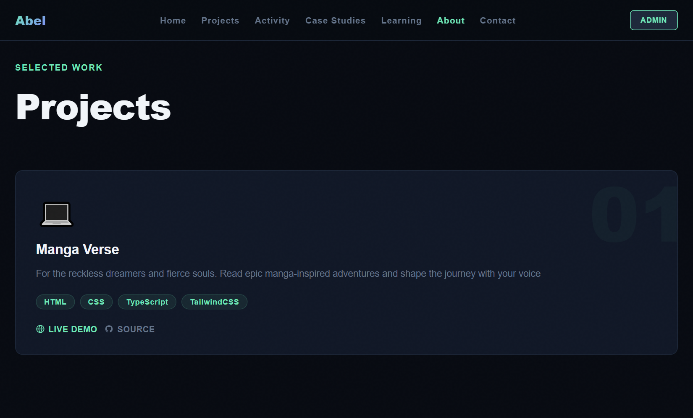
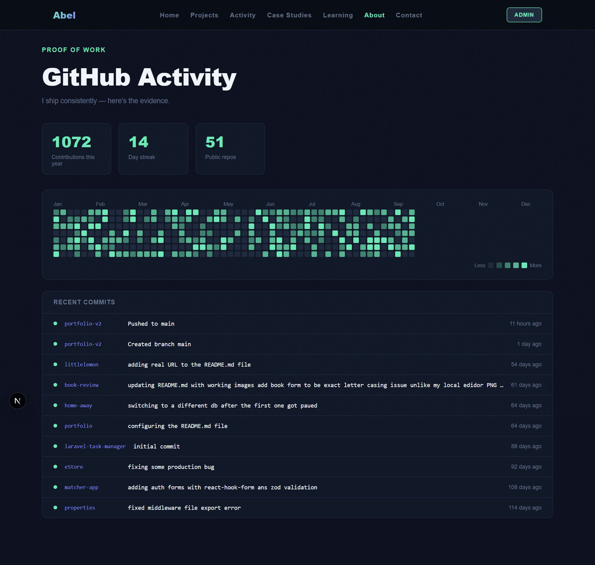
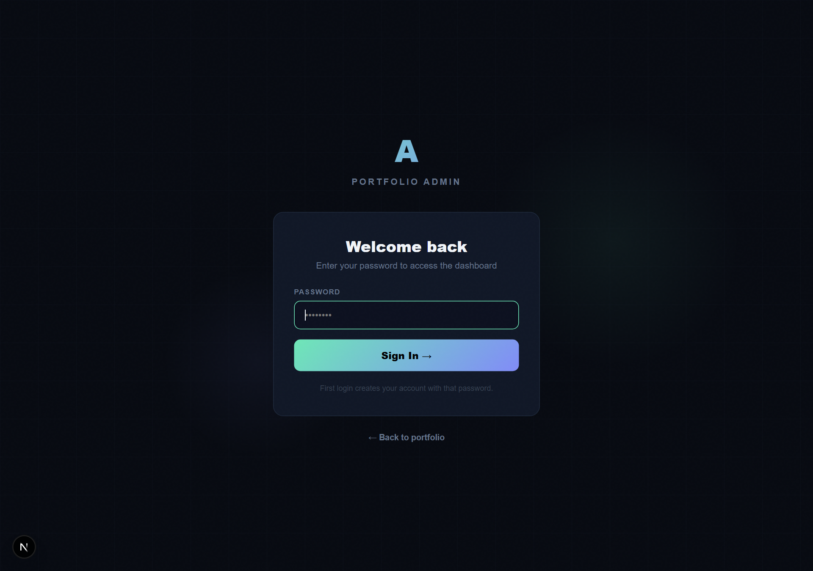
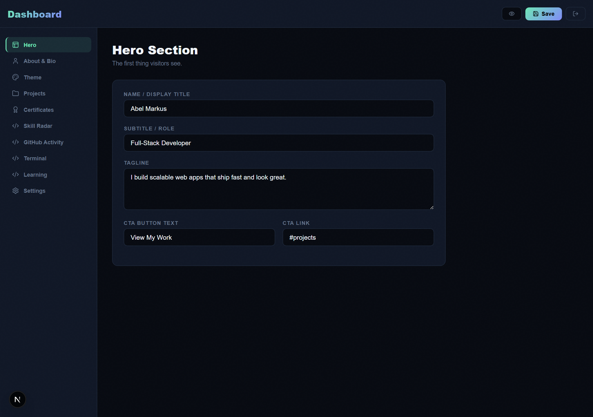

# 🚀 Professional Developer Portfolio

A modern, high-performance, and completely database-driven developer portfolio website. Built using **Next.js (App Router)**, **TypeScript**, **Tailwind CSS**, and **SQLite (sql.js)**. 

Featuring interactive user experience elements (like a retro CLI terminal, a custom SVG skills radar, and a real-time GitHub feed) alongside a secure, full-CRUD administrative command center to manage your portfolio settings, theme colors, projects, and credentials without redeploying code.

---

## 🎨 Visual Preview

### Portfolio Social Banner


---

## ✨ Key Features

- **⚡ Modern Landing Page**: Clean, fluid layout featuring custom background grids, radial glow effects, bio sections, and dynamic category tabs.
- **🛠️ Admin Command Center**: A secure dashboard (`/dashboard`) utilizing JWT authentication to manage:
  - Theme colors (accent colors, background colors) on-the-fly.
  - Profile & Hero text content.
  - Projects & Case Studies (full CRUD operation).
  - Certificates and credentials.
  - Skills radar mapping.
- **📂 Portable SQLite Database**: Powered by `sql.js` (SQLite compiled to WebAssembly), maintaining data locally in `data/portfolio.db` for zero-configuration, self-hosted deployment.
- **💻 Interactive Retro Terminal**: A fully functional retro-style CLI terminal component (`components/Terminal.tsx`) that processes commands such as `help`, `about`, `skills`, `projects`, `clear`, and more.
- **📊 Skills Radar Chart**: Custom SVG radar chart (`components/SkillRadar.tsx`) visualizing developer proficiencies, customizable dynamically through the admin dashboard.
- **🐙 Live GitHub Feed**: Dynamic integration fetching commit events, repositories, and contribution statistics directly from your public GitHub profile (`app/api/github/route.ts`).
- **🎓 Certificates Showcase**: Detailed listing of earned certificates, featuring credentials URLs and key skills associated with each course or path.

---

## 📸 Interface Showcases

### 1. Home Page & Hero Section

*High-impact welcome banner featuring dynamic accent glows, direct social links, and clear call-to-action.*

---

### 2. Projects & Case Studies

*Modern responsive grid showcasing project technology tags, visual icons, source links, and live deployment links.*

---

### 3. GitHub Activity Feed

*A custom contributions heatmap and active feed showing recent commits parsed directly from the GitHub API.*

---

### 4. Admin Security Access

*Secure portal authentication protecting the administrative dashboard.*

---

### 5. Control Dashboard

*The administrator dashboard allowing direct modification of databases, theme values, active skills, and projects list.*

---

## 🛠️ Technology Stack

- **Framework**: [Next.js (App Router)](https://nextjs.org/)
- **Programming Language**: [TypeScript](https://www.typescriptlang.org/)
- **Database**: [sql.js](https://sql.js.org/) (SQLite via WASM)
- **Styling**: CSS Variables & [Tailwind CSS](https://tailwindcss.com/)
- **Icons**: [Lucide React](https://lucide.dev/)
- **Authentication**: JWT-based session stored in cookies

---

## 🚀 Getting Started

### Prerequisites
- Node.js 18.x or later
- npm or yarn

### Installation

1. **Clone the repository:**
   ```bash
   git clone https://github.com/your-username/portfolio-v2.git
   cd portfolio-v2
   ```

2. **Install project dependencies:**
   ```bash
   npm install
   ```

3. **Initialize the SQLite database:**
   The SQLite schema will automatically initialize on the first start of the server. Default admin credentials:
   - **Username**: `admin`
   - **Password**: `password`
   
   > [!WARNING]
   > For production deployments, change the default password immediately in the admin dashboard.

4. **Launch the development server:**
   ```bash
   npm run dev
   ```

5. **Open local instance:**
   Navigate to `http://localhost:3000` (or `http://localhost:3001` if port 3000 is occupied).

---

## 🔒 Directory Structure

```text
├── app/
│   ├── api/            # API routes (projects, auth, github, certificates)
│   ├── dashboard/      # Admin dashboard interface
│   ├── login/          # Security portal login
│   ├── globals.css     # Design tokens and custom theme styling
│   └── page.tsx        # Portfolio main rendering file
├── components/         # Reusable UI elements (Terminal, SkillRadar, GitHub Feed, etc.)
├── data/               # SQLite portfolio.db storage location
├── lib/                # SQLite helper utilities, store, and auth actions
├── public/             # Static public assets and screenshots
└── tailwind.config.ts  # Tailwind CSS utility definitions
```

---

## 📄 License

This project is open-source and licensed under the [MIT License](LICENSE).
